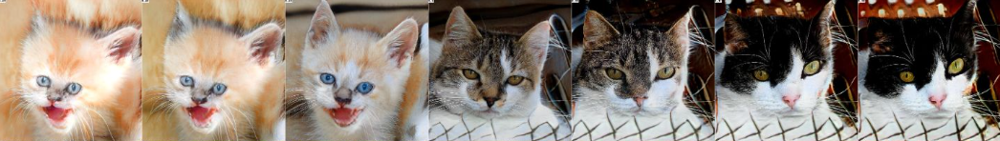

# ImageGANs

Testing with different state of art GAN models for image generation.

Three Jupyter Notebooks are included:
- Human faces to anime faces using CycleGAN. <a href="https://www.kaggle.com/datasets/soumikrakshit/anime-faces" target="_blank">Anime Faces Dataset</a>, <a href="https://www.kaggle.com/datasets/ashwingupta3012/human-faces" target="_blank">Human Faces Dataset</a>
- Cat image generation with pretrained StyleGAN2 model and CLIP
- Sneakers image generation with StyleGAN3

## Table of Contents

- [Installation](#installation)
- [Example Images](#Example Images)

## Installation

Google Colab is all you need!

## Example Images

